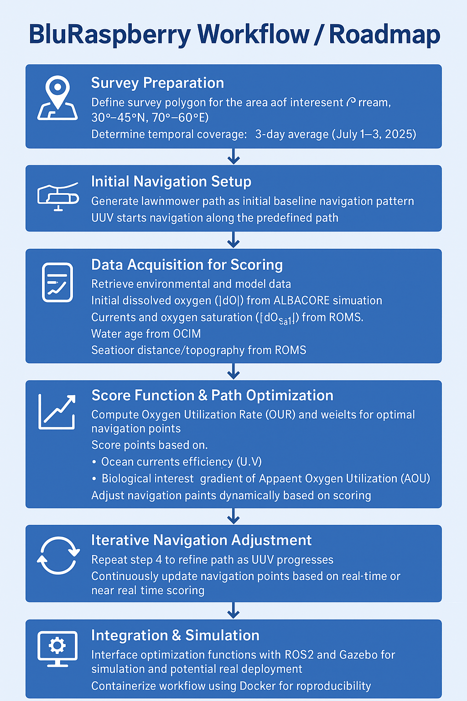

# BluRaspberry
**B**iogeochemistry **L**awnmower **U**UV - Raspberry Pi

Optimal Unmanned underwater vehicles (UUVs) Path Planning
   

**Folder Structure**
* `final_notebooks` Notebooks that you can check out if you interested in the process or reproduce what we did.
* `data` Dataset are shared here.

<!--More elaborate structure for a data science project: [Here](https://cookiecutter-data-science.drivendata.org/#directory-structure) is an example of a more elaborate structure for a data science project.-->

## One-line Description
We aim to develop a system that determine the real-time optimal path for an UUV to explore biologically active regions across a transect of North Atlantic.

## Collaborators

| Name                | Role                |
|---------------------|---------------------|
| Erin Linebarger     | Participant         |
| Joyce Cai           | Participant         |
| Kayla Mitchell      | Participant         |
| Christian Sarason   | Project Facilitator |

## Planning

* Initial idea: use numerical model outputs to simulate potential scenarios for the UUV
* Ideation jam board: [link](https://www.figma.com/board/mTpn6HdqrURccqMxZJdo3D/blue-raspberry?node-id=0-1&t=hRSpES27tXPrWp6H-1)
* Slack channel: #ohw25_proj_blu_raspberry
* Final presentation: Add link

## Background

## Goals
**Optimization Function for Path Planning**
- Develop an algorithm that dynamically adjusts UUV navigation points to maximize sampling efficiency of biological targets (e.g., algal blooms) in the North Atlantic.
- Incorporate environmental variables such as geostrophic currents, temperature, salinity, oxygen utilization, water age, and seafloor distribution.

**Integration with Robotic Control Systems**
- Create scripts to connect Python-based optimization functions with ROS2, enabling potential direct deployment on UUV platforms.
- Containerize ROS simulations using Docker for reproducibility and open-source use.
- Ensure compatibility with Gazebo for simulation testing.

**Targeted Data Acquisition**
- Implement a scripted workflow to extract only the necessary oceanographic model data, avoiding full global downloads.
- Download selected variables from the MERCATOR global ocean reanalysis for a defined region, time range, and depth, saving them locally as netCDF files.

## Datasets and Methodology
**UUV Control and Simulation**
- ROS2
- Gazebo

**Simulated Ocean field**
- **OCIM** (Ocean Circulation Inverse Model): A global ocean circulation inverse model that estimates large-scale transport and tracer distributions using observational constraints. We use 2° × 2° horizonal resolution and 24 layer.
- **Global Ocean Physics Analysis and Forecast**: Dataset provides comprehensive, high-resolution ocean state estimates, based on the NEMO (Nucleus for European Modelling of the Ocean) model, a state-of-the-art ocean general circulation model that simulates three-dimensional ocean dynamics, thermodynamics, and sea-ice interactions, assimilating observations to produce accurate analyses and forecasts of the global ocean state. We use 1/12° resolution in the upper 1000 m with a three-day averaging.

**Region and time**
- Gulf Stream, North Atlantic (30°–45°N, 70°–60°E)
- 3-day average: July 1–3, 2025

**Score function**
Develop the score function based on different considerations, including
- Efficiency: utilize ocean geostrophic current velocity (u,v)
- Biological insteret: gradient of Apparent Oxygen Utilization (AOU). Larger gradient, higer score. AOU is calculated based on temperature and salinity.

## Workflow/Roadmap

## Results/Findings

## Lessons Learned

## References

